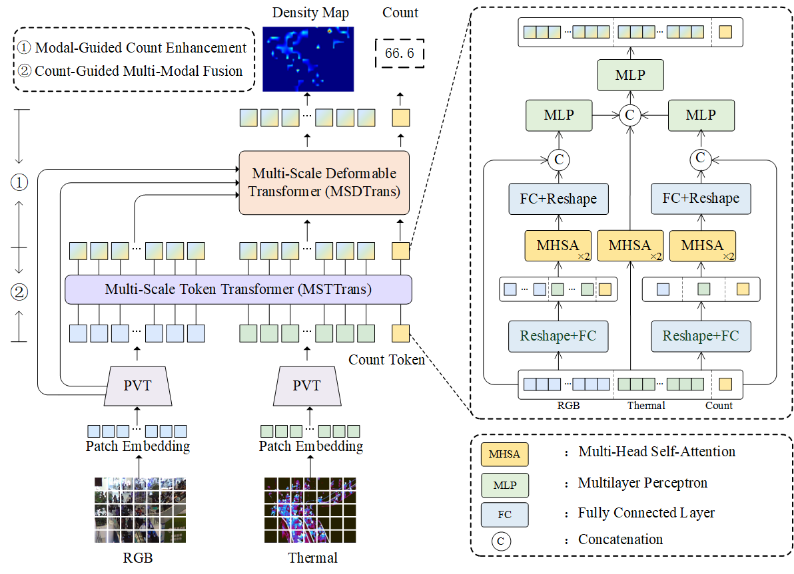

# RGB-T Multi-Modal Crowd Counting Based on Transformer

The paper has been published by BMVC 2022.

The details are in https://bmvc2022.mpi-inf.mpg.de/0427.pdf



## Code
链接：https://pan.baidu.com/s/1sYlFQXqGiY8ykOpehH_kkQ 
提取码：jrux 


## Pretraining Parameter
链接：https://pan.baidu.com/s/1RmQEKXC_-nzdQo76tazspg 
提取码：neqq 


## Results

### [RGB-T CC dataset](https://github.com/chen-judge/RGBTCrowdCounting)
|Methods|GAME(0)↓| GAME(1)↓ |GAME(2)↓ |GAME(3)↓ | RMSE↓|
| :---: | :---: | :---: | :---: | :---: | :---: | 
|CMCRL|15.61| 19.95| 24.69 |32.89| 28.18|
|TAFNet|12.38 |16.98| 21.86 |30.19| 22.45
|MAT|12.35| 16.29 |20.81 |29.09| 22.53|
|DEFNet|11.90 |16.08 |20.19 |27.27 |21.09|
|**Ours**|**10.90** |**14.81** |**19.02** |**26.14** |**18.79**|

Note:
preprocess_RGBT.py convert.json files into .npy files.
predataset_RGBT_CC.py is used to change the size of input images.

If you have any question, please email  liuzywen@ahu.edu.cn

Please cite:
```
@inproceedings{liu2022RGBT, 
  title={{RGB-T Multi-Modal Crowd Counting Based on Transformer}},  
  author={Zhengyi Liu and Wei Wu and Yacheng Tan and Guanghui Zhang},  
  booktitle={Procedings of British Machine Vision Conference},  
  pages={1--14},  
  year={2022} 
}
```
****

## Install dependencies
torch >= 1.0 torchvision opencv numpy scipy, all the dependencies can be easily installed by pip or conda

This code was tested with python 3.8.

install MultiScaleDeformableAttention:
```
cd ./models/ops     
sh ./make.sh
```

## Preprocessing
File predataset_RGBT_CC.py is used to process RGBT-CC datasets to obtain pictures of different sizes.
```
python predataset_RGBT_CC.py
```

## Training
Edit this file for training our model.

training hyperparameters as:
```
--data-dir = ""  # train datasets path.
--save-dir = ""  # save model path.
--pretrained_model = ""  # pre-trained parameters
--max-epoch = 500
--val-epoch = 1
--val_start = 30
--batch-size = 16

```

```
bash train.sh
```

## Testing
Edit this file for testing models.
testing hyperparameters as :
```
--data-dir = ""  # test datasets path
--save-dir = ""  # saved model path
--model = ""  # best_model_XXXXX.pth
```

```
bash test.sh
```


